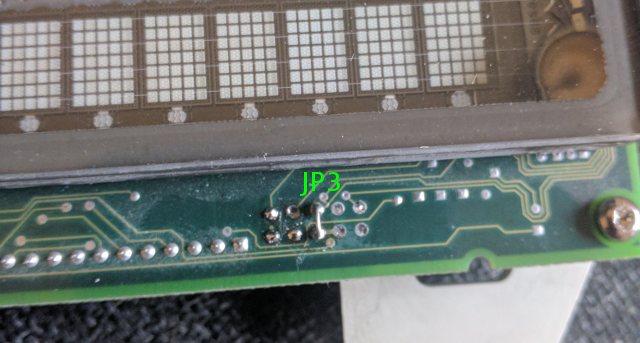
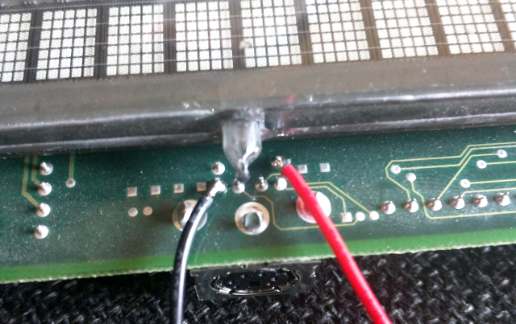
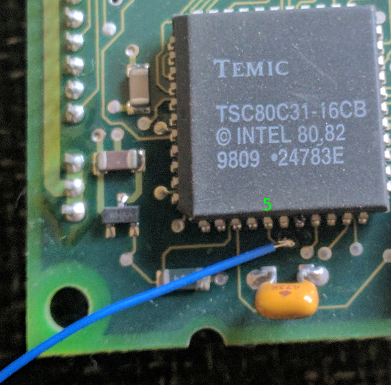

# RPi-BA63

Python code and Hardware modifications to use the BA63 Vacuum Fluorescent display with the Raspberry Pi

The BA63 display is a Vacuum Fluorescent display with a RS232 serial interface. These are easy to control over serial, but if you want to control it with the Raspberry Pi, there a a couple of small hitches:

1 The Raspberry Pi cannot drive 12v serial.

2 Seemingly the Raspberry pi built in serial cannot be changed to odd parity that the display expects by default.

https://www.dieboldnixdorf.com/-/media/diebold/ag-downloads/poslotterysystems/manuals/peripherals/baxx/ba63_display_operating_manual_english.pdf

From the manual we can see it is easy to turn parity off by simmply jumpering JP3

To power the display (12v) you can either use the PS/2 port, or solder wires directly to the pins as shown below. Be careful not to strike the vacuum sealing pip with your soldering iron:

To drive the serial directly from the Raspberry Pi, we simply need to find a pint on the circuit that will accept our 3v3 levels.
The BA63 is controlled with the TEMIC TSC80C31-16CB pin 5 is the RX pin.
https://html.alldatasheet.com/html-pdf/29664/TEMIC/TSC80C31-16CB/406/3/TSC80C31-16CB.html

There is a convenient pad on the board that a small piece of wire wrap wire can be soldered to:

Connect your Raspberry Pi tx pin to this, and you are good to go.

All the Python code is in src/ containing demos that: Display Text, Display the time, Scroll text and so on.
Code is well commented but refer to the BA63 manual for esape codes etc.

